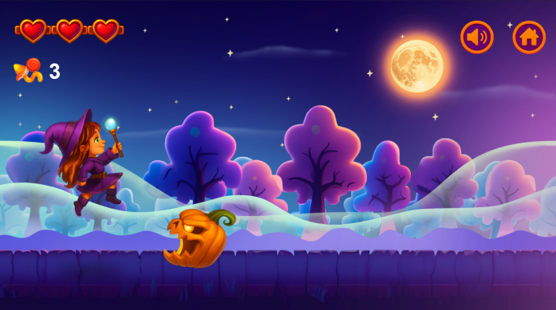

# Run Witch Run - Game Website

A beautiful, responsive website for the **Run Witch Run** endless runner game. Built with React, Tailwind CSS, and Vite for optimal performance.



## 🎮 About the Game

**Run Witch Run** is an exciting endless runner game where you play as a witch navigating through a magical night sky. Dodge obstacles, collect power-ups, manage your health, and compete for the highest score!

### Game Features
- **Fast-Paced Action**: Dodge obstacles and enemies as difficulty increases
- **Health System**: Manage your health and collect hearts to restore energy
- **High Score Challenge**: Compete for the highest score with endless replayability
- **Beautiful Graphics**: Stunning pixel art with magical visuals
- **Responsive Design**: Play on desktop, tablet, or mobile

## 🚀 Quick Start

### Prerequisites
- Node.js 18+ 
- pnpm (recommended) or npm

### Installation

```bash
# Clone the repository
git clone https://github.com/yourusername/run-witch-run-website.git
cd run-witch-run-website

# Install dependencies
pnpm install

# Start development server
pnpm dev

# Build for production
pnpm build

# Preview production build
pnpm preview
```

The website will be available at `http://localhost:3000`

## 📁 Project Structure

```
run-witch-run-website/
├── client/
│   ├── public/
│   │   ├── game/              # Embedded game files
│   │   └── screenshots/       # Game screenshots
│   ├── src/
│   │   ├── pages/
│   │   │   └── Home.tsx       # Main landing page
│   │   ├── components/        # Reusable UI components
│   │   ├── App.tsx            # App routing
│   │   ├── main.tsx           # React entry point
│   │   └── index.css          # Global styles & theme
│   └── index.html
├── server/                    # Backend placeholder (static only)
├── package.json
├── vite.config.ts
├── tailwind.config.ts
├── tsconfig.json
└── README.md
```

## 🎨 Design

The website features a **playful enchantment** design philosophy with:

- **Color Scheme**: Deep purple (#6B46C1) and warm orange (#F97316) on dark background (#0F172A)
- **Typography**: Poppins font family for modern, playful feel
- **Animations**: Smooth transitions and glowing effects
- **Responsive**: Mobile-first design that works on all devices

### Key Sections
1. **Navigation Header** - Sticky header with quick access to play
2. **Hero Section** - Game preview and main call-to-action
3. **Features** - Showcase of game mechanics
4. **Game Embed** - Playable game with instructions
5. **Gallery** - Screenshots from gameplay
6. **Footer** - Links and information

## 🛠️ Tech Stack

- **Frontend Framework**: React 19
- **Styling**: Tailwind CSS 4
- **UI Components**: shadcn/ui
- **Build Tool**: Vite
- **Routing**: Wouter
- **Icons**: Lucide React
- **Game Engine**: Construct 3 (HTML5)

## 📦 Available Scripts

```bash
# Development
pnpm dev          # Start dev server with HMR
pnpm check        # TypeScript type checking

# Production
pnpm build        # Build for production
pnpm preview      # Preview production build
pnpm start        # Start production server

# Code Quality
pnpm format       # Format code with Prettier
```

## 🌐 Deployment

### Vercel (Recommended)

The project is configured for easy deployment to Vercel:

1. Push to GitHub
2. Connect your repository to Vercel
3. Vercel will automatically detect the configuration and deploy

```bash
# Or deploy directly with Vercel CLI
vercel
```

### Manual Deployment

```bash
# Build the project
pnpm build

# The `dist` folder contains your production-ready website
# Upload the contents to any static hosting service
```

## 🎮 How to Play

### Controls
- **Arrow Keys / WASD**: Move left and right
- **Space**: Jump over obstacles
- **Avoid**: Enemies and obstacles
- **Collect**: Hearts and power-ups

### Tips
- Stay focused as the game gets faster
- Plan ahead and anticipate obstacles
- Use power-ups strategically
- Practice to learn the patterns

## 📱 Browser Support

- Chrome/Edge 90+
- Firefox 88+
- Safari 14+
- Mobile browsers (iOS Safari, Chrome Mobile)

## 🔧 Configuration

### Environment Variables

Create a `.env.local` file for development:

```env
# Analytics (optional)
VITE_ANALYTICS_ENDPOINT=https://your-analytics.com
VITE_ANALYTICS_WEBSITE_ID=your-id
```

### Customization

- **Colors**: Edit CSS variables in `client/src/index.css`
- **Fonts**: Update Google Fonts link in `client/index.html`
- **Game Settings**: Modify game files in `client/public/game/`

## 📄 License

This project is open source and available under the MIT License.

## 🤝 Contributing

Contributions are welcome! Please feel free to submit a Pull Request.

## 📞 Support

For issues, questions, or suggestions, please open an issue on GitHub.

---

**Made with ❤️ for endless gaming fun**
